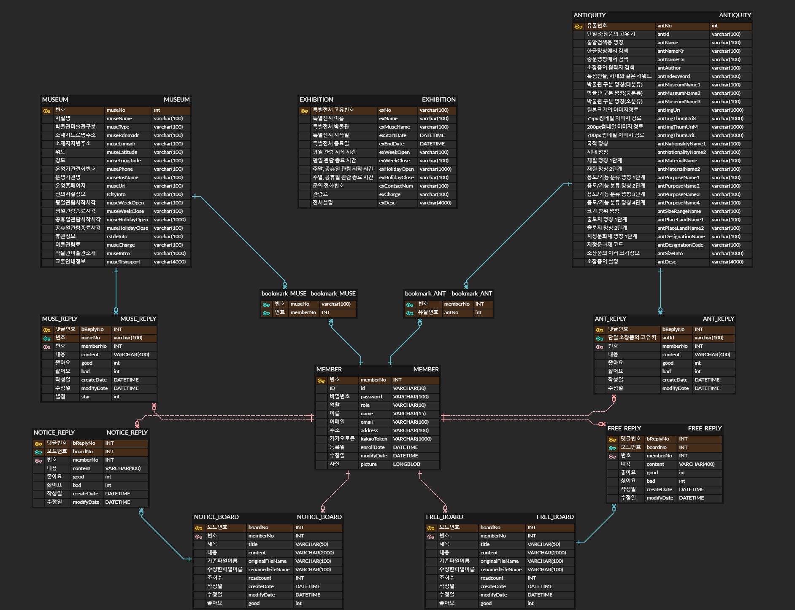

# &#127963; 한눈에 보는 유물 - 사부작

- 소개&nbsp;&nbsp;&nbsp;&nbsp;&nbsp;&nbsp;&nbsp;&nbsp;&nbsp;&nbsp;&nbsp;&nbsp;&nbsp;&nbsp;&nbsp;&nbsp;&nbsp;&nbsp;&nbsp;&nbsp;&nbsp;&nbsp;&nbsp;&nbsp;**Spring을 활용한 한눈에 볼 수 있는 유물 사이트**    
- 관련활동&nbsp;&nbsp;&nbsp;&nbsp;&nbsp;&nbsp;&nbsp;&nbsp;&nbsp;&nbsp;&nbsp;&nbsp;&nbsp;&nbsp;&nbsp;&nbsp;&nbsp;K-Digital Training 멀티캠퍼스
- 진행 기간&nbsp;&nbsp;&nbsp;&nbsp;&nbsp;&nbsp;&nbsp;&nbsp;&nbsp;&nbsp;&nbsp;&nbsp;&nbsp;&nbsp;&nbsp;&nbsp;2022년 11월 29일 ~ 2023년 01월 02일

<br>
<br>


## 🔗Github

- [sabuzak - Github](https://github.com/93backend/sabuzak.git)

<br>
<br>


## 📄 상세 내용


```
💡 	▷ 박물관 검색
   	 - 지역별,박물관명 상세 검색 기능
	▷ 유물 검색
   	 - 유물명, 출토지, 시대 카테고리로 상세 검색 기능
	▷특별전시 검색
   	 - 전시명/박물관명 검색
	▷ 게시판 / 공지사항
  	 - 글쓰기/ 수정/ 삭제
   	 - 조회수/좋아요
  	 - 댓글 작성/삭제
	▷ 마이페이지
  	 - 회원 정보수정/탈퇴, 내가 쓴 글 목록, 즐겨찾기
	▷ 로그인
  	 - 로그인, 회원가입
```


<br>
<br>


| 🗣️ **언어** | 🕸️ **프레임워크/라이브러리** |  🛠️ **개발 도구**   | 🔱 **협업도구** |   📃  **API**   |
| :--------: | :-------------------------: | :----------------: | :------------: | :------------: |
|    Java    |           Spring            |      Eclipse       |      Zoom      | 카카오 로그인  |
|   MySQL    |           Lombok            | Visual Studio Code |     Notion     |   카카오 맵    |
|    JSP     |           JQuery            |   Apache Tomcat    |    Discord     | 공공데이터포털 |
|   HTML5    |          BootStrap          |                    |     Github     |    e뮤지엄     |
|    CSS3    |           Mybatis           |                    |    ERDCloud    |                |
|    Ajax    |                             |                    |  Google Drive  |                |


## 👧 담당한 기능

- UI 시안
  - [ui시안.pdf](https://s3-us-west-2.amazonaws.com/secure.notion-static.com/1c77f4df-13ad-45f7-9b16-d3c721cbe256/ui시안.pdf)

- 프론트
  - 박물관 , 유물 찜 페이지 (antiWishlist.html, museumWishlist.html)
  - 게시판 상세페이지 (boardDetail.html)
  - 박물관 상세페이지 (museumDetails.html)
  - 지도 페이지 (map.html)
- 백엔드
  - 공지사항, 자유게시판 페이지								
    - 자유게시판 목록, 공지사항 목록
      - 공지사항 작성 (only 관리자), 게시글 작성
      - 공지사항 검색, 게시글 검색
    - 공지사항, 게시글 상세
      - 공지사항 수정/삭제(only 관리자), 게시글 수정/삭제
      - 파일다운
      - 댓글 작성/삭제
      - 좋아요


## 💻 프로젝트 관련 자료

- **사이트 맵 및 기능리스트**

  - [5조_한눈에 보는 유물 정보 .xmind](https://s3-us-west-2.amazonaws.com/secure.notion-static.com/5a2cde8a-1b24-42ee-8655-af5f9295f923/5조_한눈에_보는_유물_정보_.xmind)

  - [5조_사부작_사이트맵 및 기능리스트 우선순위.xmind](https://s3-us-west-2.amazonaws.com/secure.notion-static.com/2398a353-f0b9-40d5-8131-c2c9a4625d0f/5조_사부작_사이트맵_및_기능리스트_우선순위.xmind)

- **UI 기회안**

  - [UI기획안.pdf](https://s3-us-west-2.amazonaws.com/secure.notion-static.com/a752affc-2472-4b1d-b39a-fbe46ec9ec52/UI기획안.pdf)

- **ERD**

​		 

- **PPT** 
  - [5조_사부작_포트폴리오.pdf](project/5조_사부작_포트폴리오.pdf) 
