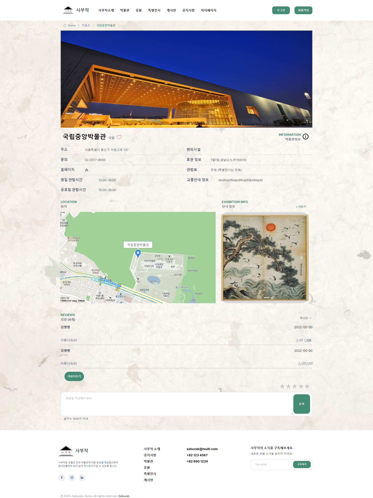
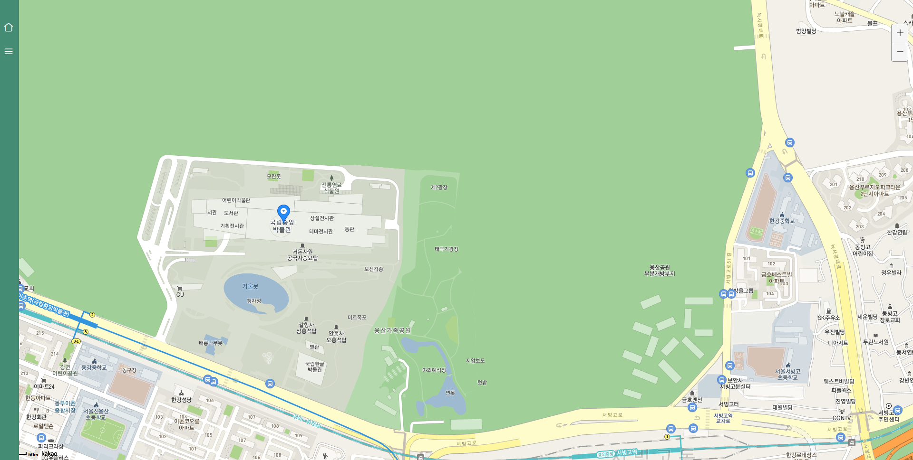
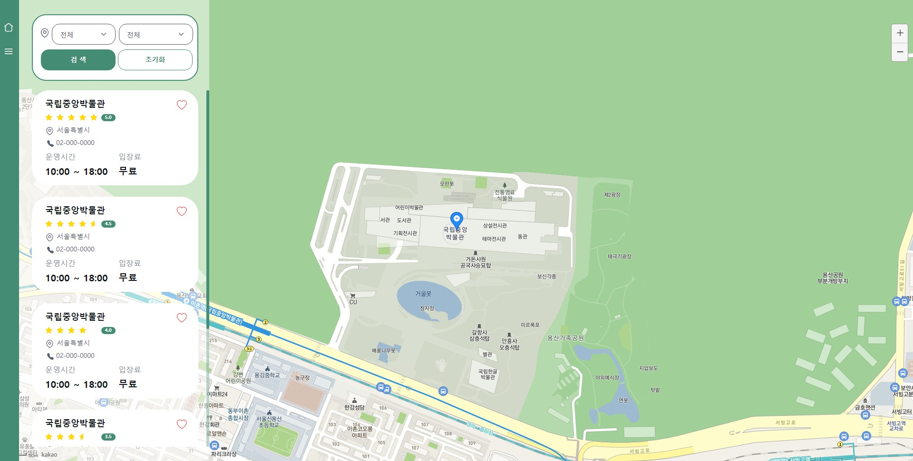
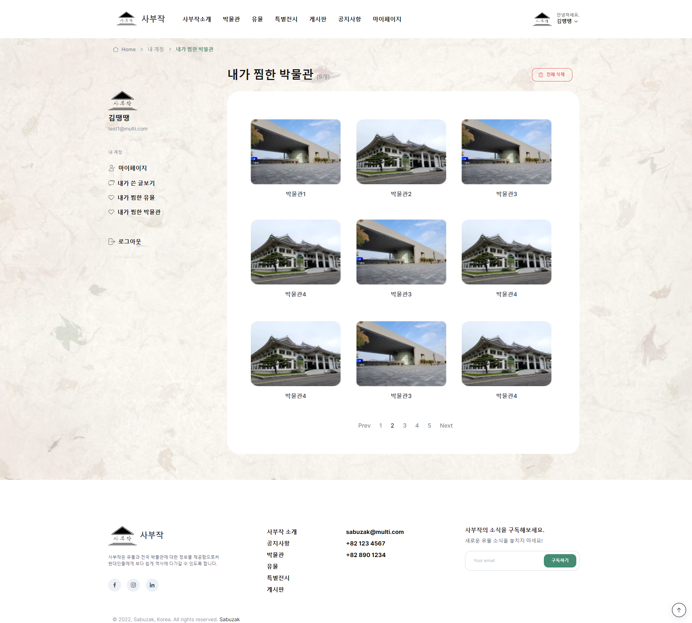

<h1>Semi-Project 개인개발(front)</h1>

~~~
👌 Semi-Project 개인개발
	- 박물관 상세보기 page
	- 게시판 상세보기 page
	- 지도 page
	- 찜 목록 page (박물관, 유물)
~~~


### 1. 박물관 상세보기 page

- 박물관 정보 테이블 (완)
- 찜(하트)버튼(완)
- 카카오 맵 api 지도 표시 (완)

​		-  [Kakao 지도 API](https://apis.map.kakao.com/web/sample/addr2coord/)

- 전시정보 슬라이드 (완)
- 리뷰 더보기 (완)

```
$(function () {
    isHidden = false;
    $('.reviewlist').slice(0, 2).show();
    if ($('div:hidden').length == 0)
    {
        document.getElementById('seeMore').innerText = '리뷰없음';
    }
    $('#seeMore').click(function (e) {
        if (isHidden == true)
        {
            document.getElementById('seeMore').innerText = '리뷰더보기';
            $('.reviewlist').slice(0, 2).hide();
        } else
        {
            document.getElementById('seeMore').innerText = '리뷰감추기';
            $('.reviewlist').show();
        }
        isHidden = !isHidden;
    });
});
```

- 리뷰 별점 (완)

  - 참고 사이트

    [[JS\] 별점 드래그 구현](https://gurtn.tistory.com/80)

- 박물관 상세보기 page

  

### 2. 게시판 상세보기 page

- 글 정보 (완)

- 좋아요 버튼 (완)

- 댓글(완)

- 게시판 상세보기 page

  

### 3. 지도 page

- 카카오 지도 api (완)
- 사이드 바 (완)
- 지역 select (완)

```jsx
var cnt = new Array();
cnt[0] = new Array('전체');
cnt[1] = new Array('전체', '강남구', '강동구', '강북구', '강서구', '관악구', '광진구', '구로구', '금천구', '노원구', '도봉구', '동대문구', '동작구', '마포구', '서대문구', '서초구', '성동구', '성북구', '송파구', '양천구', '영등포구', '용산구', '은평구', '종로구', '중구', '중랑구');
cnt[2] = new Array('전체', '강서구', '금정구', '남구', '동구', '동래구', '부산진구', '북구', '사상구', '사하구', '서구', '수영구', '연제구', '영도구', '중구', '해운대구', '기장군');
cnt[3] = new Array('전체', '남구', '달서구', '동구', '북구', '서구', '수성구', '중구', '달성군');
cnt[4] = new Array('전체', '계양구', '남구', '남동구', '동구', '부평구', '서구', '연수구', '중구', '강화군', '옹진군');
cnt[5] = new Array('전체', '광산구', '남구', '동구', '북구', '서구');
cnt[6] = new Array('전체', '대덕구', '동구', '서구', '유성구', '중구');
cnt[7] = new Array('전체', '남구', '동구', '북구', '중구', '울주군');
cnt[8] = new Array('전체');
cnt[9] = new Array('전체', '고양시', '과천시', '광명시', '구리시', '군포시', '남양주시', '동두천시', '부천시', '성남시', '수원시', '시흥시', '안산시', '안양시', '오산시', '의왕시', '의정부시', '평택시', '하남시', '가평군', '광주시', '김포시', '안성시', '양주군', '양평군', '여주군', '연천군', '용인시', '이천군', '파주시', '포천시', '화성시');
cnt[10] = new Array('전체', '강릉시', '동해시', '삼척시', '속초시', '원주시', '춘천시', '태백시', '고성군', '양구군', '양양군', '영월군', '인제군', '정선군', '철원군', '평창군', '홍천군', '화천군', '황성군');
cnt[11] = new Array('전체', '제천시', '청주시', '충주시', '괴산군', '단양군', '보은군', '영동군', '옥천군', '음성군', '진천군', '청원군');
cnt[12] = new Array('전체', '공주시', '보령시', '서산시', '아산시', '천안시', '금산군', '논산군', '당진군', '부여군', '서천군', '연기군', '예산군', '청양군', '태안군', '홍성군');
cnt[13] = new Array('전체', '군산시', '김제시', '남원시', '익산시', '전주시', '정읍시', '고창군', '무주군', '부안군', '순창군', '완주군', '임실군', '장수군', '진안군');
cnt[14] = new Array('전체', '광양시', '나주시', '목포시', '순천시', '여수시', '여천시', '강진군', '고흥군', '곡성군', '구례군', '담양군', '무안군', '보성군', '신안군', '여천군', '영광군', '영암군', '완도군', '장성군', '장흥군', '진도군', '함평군', '해남군', '화순군');
cnt[15] = new Array('전체', '경산시', '경주시', '구미시', '김천시', '문겅시', '상주시', '안동시', '영주시', '영천시', '포항시', '고령군', '군위군', '봉화군', '성주군', '영덕군', '영양군', '예천군', '울릉군', '울진군', '의성군', '청도군', '청송군', '칠곡군');
cnt[16] = new Array('전체', '거제시', '김해시', '마산시', '밀양시', '사천시', '울산시', '진주시', '진해시', '창원시', '통영시', '거창군', '고성군', '남해군', '산청군', '양산시', '의령군', '창녕군', '하동군', '함안군', '함양군', '합천군');
cnt[17] = new Array('전체', '서귀포시', '제주시', '남제주군', '북제주군');
function change(add) {
    sel = document.form.county
    /* 옵션메뉴삭제 */
    for (i = sel.length - 1; i >= 0; i--)
    {
        sel.options[i] = null
    }
    /* 옵션박스추가 */
    for (i = 0; i < cnt[add].length; i++)
    {
        sel.options[i] = new Option(cnt[add][i], cnt[add][i]);
    }
}
```

~~~
<div class="map_search">
    <i class="ai-map-pin" id="mapicon"></i>

    <div class="mb-3">
        <form name=form method=post action="">
            <select class="form-select" id="mapCity" name='city'
                onchange="change(this.selectedIndex);" class="input" data-style="btn-form-control">
                <option value='전체'>전체</option>
                <option value='서울'>서울특별시</option>
                <option value='부산'>부산광역시</option>
                <option value='대구'>대구광역시</option>
                <option value='인천'>인천광역시</option>
                <option value='광주'>광주광역시</option>
                <option value='대전'>대전광역시</option>
                <option value='울산'>울산광역시</option>
                <option value='세종'>세종특별자치시</option>
                <option value='경기'>경기도</option>
                <option value='강원'>강원도</option>
                <option value='충북'>충청북도</option>
                <option value='충남'>충청남도</option>
                <option value='전북'>전라북도</option>
                <option value='전남'>전라남도</option>
                <option value='경북'>경상북도</option>
                <option value='경남'>경상남도</option>
                <option value='제주'>제주도</option>
            </select>
            <select class="form-select" name='county' class="select" id="mapCounty">
                <option value='전체'>전체</option>
            </select>
            <div class="row align-items-center">
                <div class="col-6 col-lg-4 mb-3 mb-lg-0">
                    <button class="btn btn-primary" type="search" id="searchbtn">검 색</button>
                </div>
                <div class="col-6 col-lg-4 mb-3 mb-lg-0" id="resetbtn">
                    <button class="btn btn-outline-primary" type="reset" id="resetbtn">초기화</button>
                </div>
            </div>
        </form>
    </div>
</div>
~~~


- 박물관 정보(완)

- 별점 (완)

  [jQuery 100 [ Star Rating \] 별점 표시하기 업그레이드 - 소수점반영하기. 소수점 비율 반영하기](https://www.youtube.com/watch?v=1szZdKZO9Rw)

  ```jsx
  var rating = $('.rating');
  
  rating.each(function () {
      var $this = $(this);
      var targetScore = $this.attr('data-rate');
      var firstdigit = targetScore.split('.');
  
      if (firstdigit.length > 1)
      {
          for (var i = 0; i < firstdigit[0]; i++)
          {
              $this.find('.star').eq(i).css({ width: '100%' });
          }
          $this.find('.star').eq(firstdigit[0]).css({ width: firstdigit[1] + '0%' });
      } else
      {
          for (var i = 0; i < targetScore; i++)
          {
              $this.find('.star').eq(i).css({ width: '100%' });
          }
      }
  
  });
  ```

  ```html
  <!-- data-rate에 값 넣으면 값과 맞게 별개수 변경됨 -->
  
  <div class="d-flex">
      <div class="rating" data-rate="5">
          <div class="star-wrap">
              <div class="star"><i class="ai-star-filled"></i></div>
          </div>
          <div class="star-wrap">
              <div class="star"><i class="ai-star-filled"></i></div>
          </div>
          <div class="star-wrap">
              <div class="star"><i class="ai-star-filled"></i></div>
          </div>
          <div class="star-wrap">
              <div class="star"><i class="ai-star-filled"></i></div>
          </div>
          <div class="star-wrap">
              <div class="star"><i class="ai-star-filled"></i></div>
          </div>
      </div>
      <span class="badge bg-primary" id="staravg">5.0</span>
  </div>
  ```

- 찜(하트) (완)

- 지도 page

  

  

### 4. 찜 목록 page (박물관, 유물)

- 찜 목록 page (박물관, 유물)

  

  

  

  

  