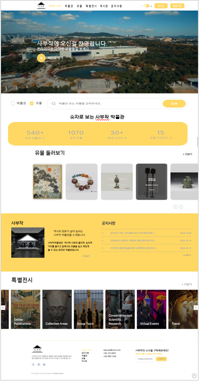
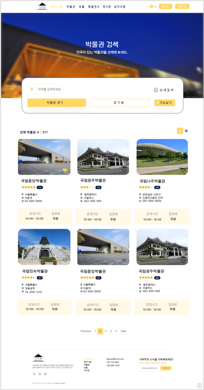

<h1>Semi-Project 기획2</h1>

~~~
👌 Semi-project 기획
	- UI 디자인 (메인,기능페이지)
	- Open API 파싱
	- ERD 작성
~~~

### 1. UI 디자인 (메인,기능페이지)시안 / 서진경

​				마이페이지 								 유물										박물관

**피드백 정리**

메인 컬러 - 노란색 X 변경

숫자로 보는 사부작 박물관 - 위에보단 아래쪽에 아니면 메이 이미지 쪽에 작게

박물관 검색창 - 검색버튼 밑으로 X , 가로로 길게 변경

### 2. open API 파싱  / 임규근

- [e뮤지엄 API](https://www.emuseum.go.kr/openApi)  
- [API_221220.xlsx](..\project\API_221220.xlsx) 

### 3. ERD 작성 / 조규완

